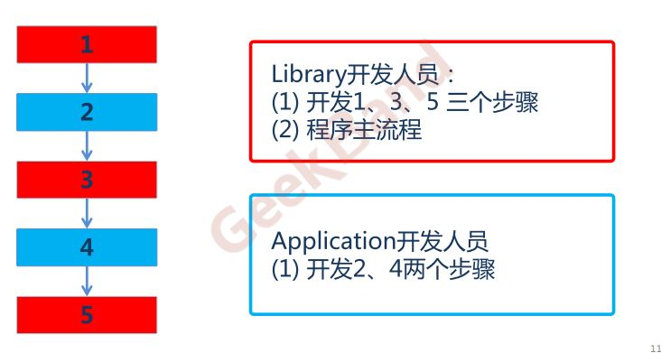
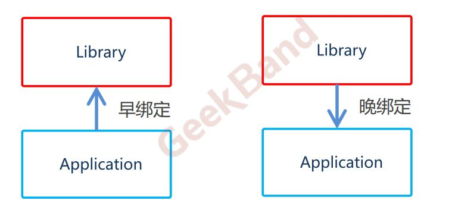

###  模板方法

##### 一、动机

+ 在软件构建过程中，对于某一项任务，它常常有稳定的整体操作结构，但各个子步骤却有很多改变的需求，或者由于固有的原因（比如框架与应用之间的关系）而无法和任务的整体结构同时实现。
+ 如何在确定稳定操作结构的前提下，来灵活应对各个子步骤的变化或者晚期实现需求？  

##### 二、结构化软件设计流程

##### 三、面向对象软件设计流程

##### 四、早绑定与晚绑定

##### 四、总结

+ 模板方法是一种非常基础性的设计模式，在面向对象系统中有着大量的应用。它用最简洁的机制（虚函数的多态性）
  为很多应用程序框架提供了灵活的扩展点，是代码复用方面的基本实现结构。  
+ 除了可以灵活应对子步骤的变化外，“不要调用我，让我来调用你”的反向控制结构是Template Method的典型应用。  
